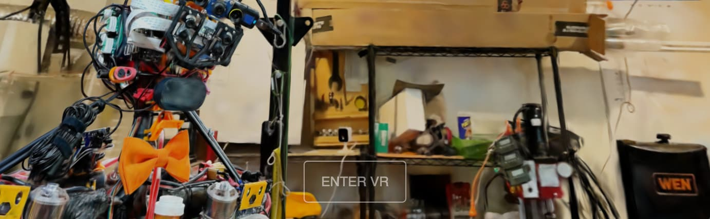

# [](https://lumalabs.ai) Luma WebGL Library

`luma-web` is a [npm package](https://www.npmjs.com/package/@lumaai/luma-web) for rendering photoreal interactive scenes captured by the [Luma app](https://lumalabs.ai/). It includes `LumaSplatsWebGL`, which is a WebGL-only gaussian splatting implementation designed to be integrated with 3D frameworks, and `LumaSplatsThree`, which is a Three.js implementation that uses `LumaSplatsWebGL` under the hood. For these examples we'll use [Three.js](https://threejs.org/).


**Request features and report bugs on our [ GitHub repo](https://github.com/lumalabs/luma-web-library)** 

### Contents
- [VR](#vr)


## VR Test
[](#vrtest)

Viewing your splats in VR is as simple as enabling XR in three.js and adding a VR button. View this demo with a VR headset (or through a headset browser) and click "Enter VR"! It will work best on PC VR, standalone VR tends to struggle with splats presently

**[DemoVRtest.ts](./src/DemoVRtest.ts)**


## VR
[](#vr)

Viewing your splats in VR is as simple as enabling XR in three.js and adding a VR button. View this demo with a VR headset (or through a headset browser) and click "Enter VR"! It will work best on PC VR, standalone VR tends to struggle with splats presently

**[DemoVR.ts](./src/DemoVR.ts)**
```typescript
import { VRButton } from "three/examples/jsm/webxr/VRButton.js";

renderer.xr.enabled = true;

let vrButton = VRButton.createButton(renderer);

document.body.appendChild(vrButton);

let splats = new LumaSplatsThree({
	// Kind Humanoid @RyanHickman
	source: 'https://lumalabs.ai/capture/83e9aae8-7023-448e-83a6-53ccb377ec86',
});

scene.add(splats);
```

