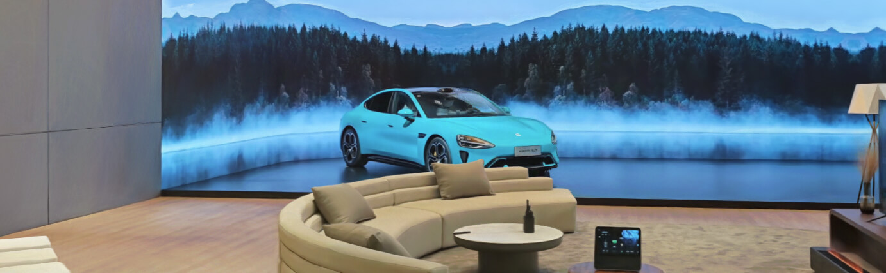

#  Luma WebGL Library

`luma-web` is a [npm package](https://www.npmjs.com/package/@lumaai/luma-web) for rendering photoreal interactive scenes captured by the [Luma app](https://lumalabs.ai/). It includes `LumaSplatsWebGL`, which is a WebGL-only gaussian splatting implementation designed to be integrated with 3D frameworks, and `LumaSplatsThree`, which is a Three.js implementation that uses `LumaSplatsWebGL` under the hood. For these examples we'll use [Three.js](https://threejs.org/).

**Request features and report bugs on our [ GitHub repo](https://github.com/lumalabs/luma-web-library)** 

### Contents
- [VR](#vr)

1. 点击图片
2. 点击 ENTER VR
3. 第一个弹窗点授权，第二个弹窗点取消，不然无法识别手势

## 魔法棋

Redmi 和哈利波特再次联名

## 人车家全生态

小米人车家全生态展厅

## 唐伯虎

上海博物馆镇馆之宝唐伯虎《秋风纨扇图》

## Da Vinci

达芬奇真迹《头发飘逸的女子》

## 特斯拉机器人

Optimus

## 地铁

纽约中央火车站

