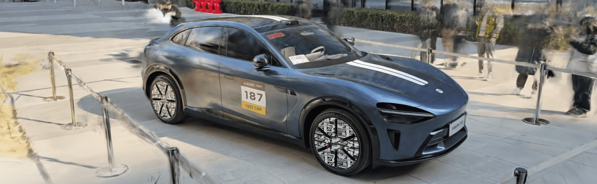

#  Luma WebGL Library

`luma-web` is a [npm package](https://www.npmjs.com/package/@lumaai/luma-web) for rendering photoreal interactive scenes captured by the [Luma app](https://lumalabs.ai/). It includes `LumaSplatsWebGL`, which is a WebGL-only gaussian splatting implementation designed to be integrated with 3D frameworks, and `LumaSplatsThree`, which is a Three.js implementation that uses `LumaSplatsWebGL` under the hood. For these examples we'll use [Three.js](https://threejs.org/).

**Request features and report bugs on our [ GitHub repo](https://github.com/lumalabs/luma-web-library)** 

### Contents
- [VR](#vr)

## 使用指南

### 开启 Safari 的 WebXR 支持
由于 visionOS 的 WebXR 支持还处于实验阶段，需手动开启，步骤如下：
1. 打开 visionOS 的系统设置
2. 选择 Apps
3. 选择 Safari
4. 滑到 Safari 设置页最底部，选择 Advanced
5. 在 Advanced 页滑到最底部，选择 Feature Flags
6. 在最上面的实验功能中，把 WebXR Device API 和 WebXR Hand Input Module 都开启
7. 然后往下滑，滑到 w 开头的部分，把 WebXR Augmented Reality Module 和 WebXR GamePads Module 这两个也打开
8. 关闭设置，就完成了

### 使用步骤
1. 点击下方某张图片
2. 点击右侧预览区域 ENTER VR
3. 弹窗出来，允许权限
4. 目前的移动方式：双指捏合，会向你当前朝向移动一个单位距离，想转向的话，扭头再双指捏合即可

## Xiaomi YU7

小米首款SUV

## Xiaomi SU7 Ultra Prototype

纽北最速四门车

## 图坦卡蒙

图坦卡蒙全身像

## 阿蒙

阿蒙头像

## 黄金面具

黄金面具

## 三星堆

三星堆青铜人头像

## 佛之海

杉本博司《佛之海》

## 心经

杉本博司《心经》

## 五四运动纪念碑

历史新的一页就这样翻开

## 魔法棋

Redmi 和哈利波特再次联名

## 人车家全生态

小米人车家全生态展厅

## 唐伯虎

上海博物馆镇馆之宝唐伯虎《秋风纨扇图》

## Da Vinci

达芬奇真迹《头发飘逸的女子》

## 特斯拉机器人

Optimus

## 地铁

纽约中央火车站

## 巴尔的摩大桥

撞断的桥

